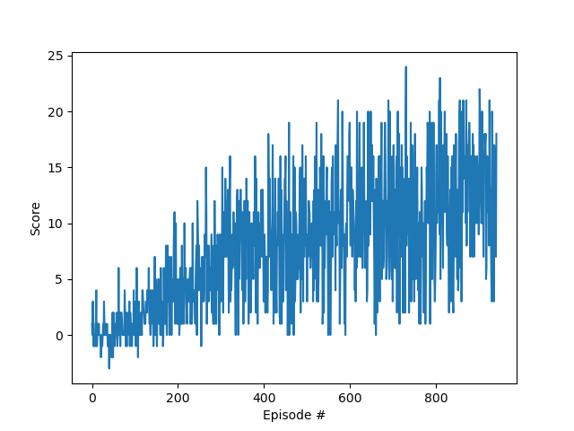
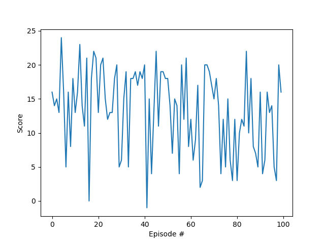

# Project Report
This document is my report for the banana-collecting Navigation project.

# Learning Algorithm
The learning algorithm is an adaptation of the Deep Q-Learning (DQN) algorithm, specifically based on the [Udacity code for solving the OpenAI Lunar Lander problem](https://github.com/udacity/deep-reinforcement-learning/tree/master/dqn/solution).  DQN uses the idea of training a deep neural network to approximate the action values _q_.  To provide improved stability while training, DQN contains the following innovations:
* Experience Replay: Tuples of (state, action, reward, next_state) are stored in a replay buffer so that the agent can learn from past experiences.
* Fixed Q-targets: Target Q-network weights are updated less often than the primary Q-network, which allows the network to avoid chasing a moving target during training.

For this implementation, the neural network architecture chosen contains the following PyTorch layers, coded in **qnetwork.py**:
* A BatchNorm1d layer to receive the input state
* A Linear layer of size 128
* A Linear layer of size 64
* A Linear layer of size 4 to generate the output action values

The BatchNorm1d layer is used for batch normalization in order to improve learning performance.  ReLU activation functions are used between the Linear hidden layers.  

Additional hyperparameters in **dqn_agent.py** and **train_banana_agent.py** are described below:
* BUFFER_SIZE: replay buffer size, i.e. max number of (S,A,R,S) tuples that can be stored
* BATCH_SIZE: minibatch size used for training
* GAMMA: discount factor for future rewards
* TAU: interpolation parameter used for soft update of target parameters
* LR: learning rate
* UPDATE_EVERY: parameter controlling how often to update the network
* EPS_START, EPS_END, EPS_DECAY: parameters for the epsilon-greedy policy, controlling how often to choose a random action

# Reward Plots
The agent solved the environment in 840 episodes.  A plot of the training rewards is shown below.

For further validation, the trained agent was run through the environment for an additional 100 episodes, achieving an average score of 13.29.  A plot of the validation rewards is shown below.

# Ideas for Future Work
This implementation uses a straightforward vanilla implementation of the DQN algorithm.  A few improvements would likely improve performance:
* Prioritized Experience Replay: Resampling tuples that generate a larger TD error could allow the algorithm to learn more from particularly important experiences.
* Frame stacking: Stacking multiple frames together into a sequence for input (as reported by DeepMind for its Atari implementations) would likely improve agent performance by allowing it to utilize a short-term memory of bananas that are not in its current field of view, but which it has seen in the past few timesteps.
